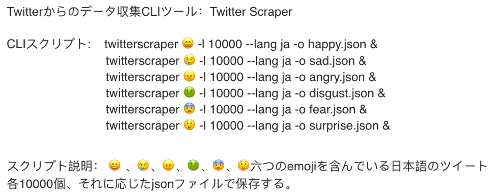
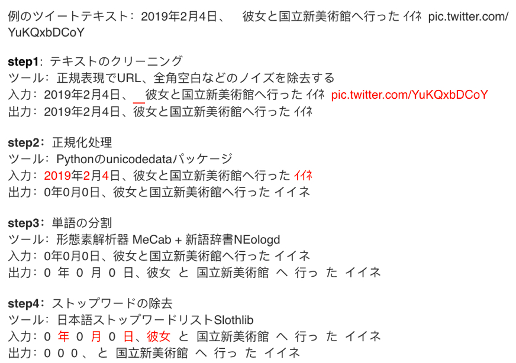
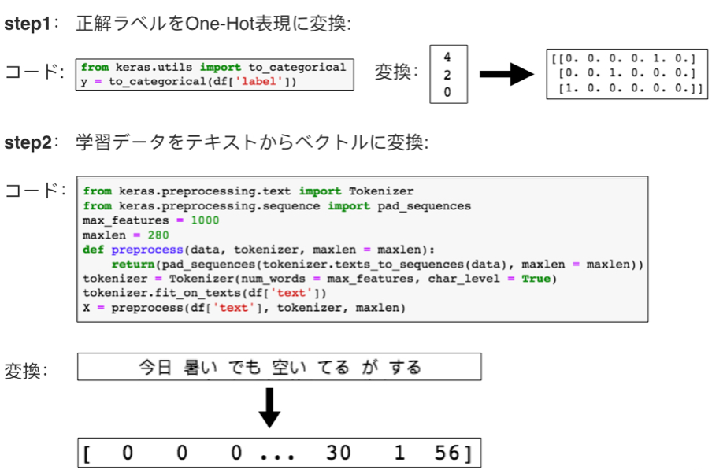
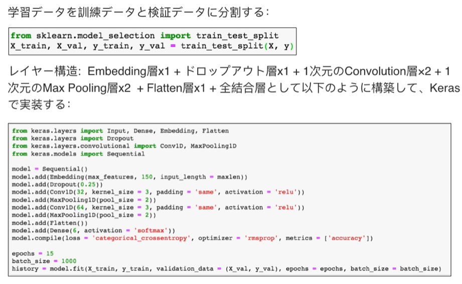

# A CNN model to classify contents to 6 kinds of emotions
 Learned from [@sugiyamath](https://qiita.com/sugiyamath/items/7cabef39390c4a07e4d8)先生

- Training/Validation data set: Tweets crawled from twiiter
- Test data set:  Comments of news post crawled from Yahoo!news

## 実装の流れ：
### 1.  学習データを集める。

### 2. 学習データに正解ラベルラベルを付く。

### 3. 自然言語処理における前処理。
前処理について、Learn from: [@musaprg先生](https://qiita.com/musaprg/items/9a572ad5c4e28f79d2ae)
[@Hironsan先生](https://qiita.com/Hironsan/items/2466fe0f344115aff177)

### 4. 学習データのベクトル表見

### 5. CNNモデルの構築

